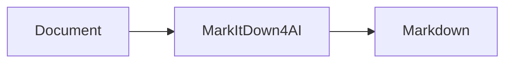
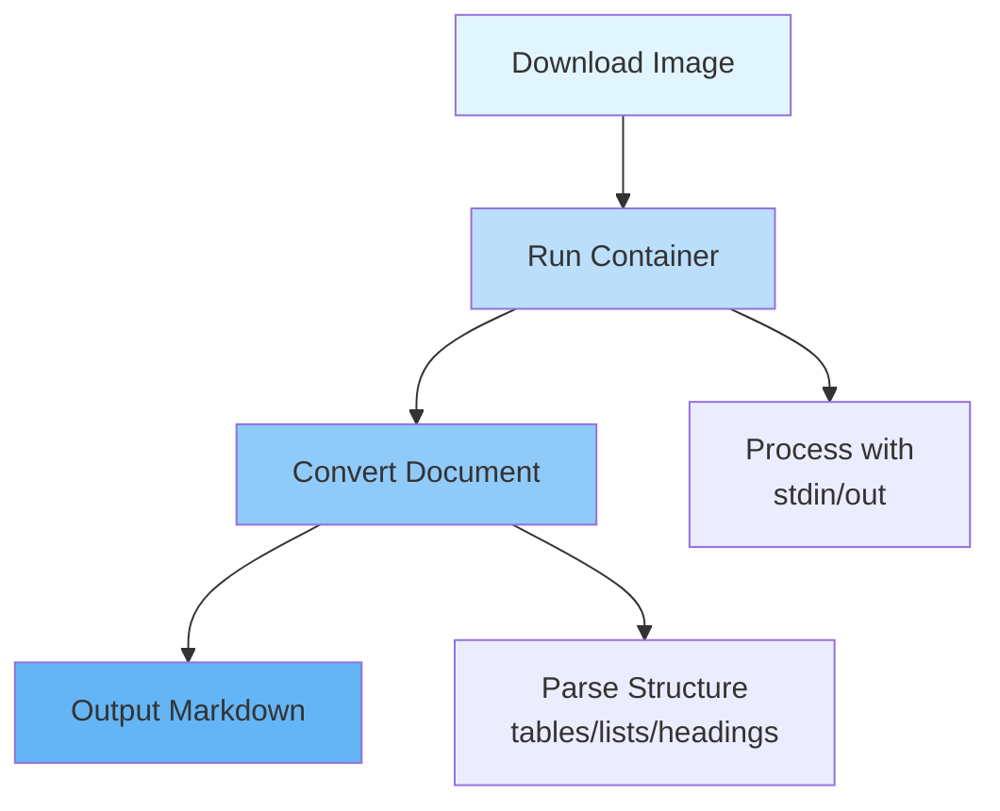

# MarkItDown4AI (MarkItDown-for-AI)


Containerized MarkItDown to easily convert documents to Markdown.



## What is MarkItDown4AI?

MarkItDown (markitdown-for-ai) converts documents from popular formats into clean Markdown text. It preserves document structure including tables, lists, headings, and basic formatting — perfect for content extraction, automation workflows, and AI integration.

Uses Microsoft's MarkITDown library with Docker/Podman containers — no Python installation needed.

```bash
docker run --rm -i ghcr.io/OpenTechIL/markitdown-for-ai < file.pdf
```

## Quick Start

```bash
docker run --rm -i ghcr.io/opentechil/markitdown-for-ai < file.pdf
```

## Usage

### Convert a File

```bash
docker run --rm -i ghcr.io/opentechil/markitdown-for-ai < input.pdf
```

### Convert via pipe

```bash
cat file.docx | docker run --rm -i ghcr.io/opentechil/markitdown-for-ai
```

### Specify output file

```bash
docker run --rm ghcr.io/opentechil/markitdown-for-ai input.pdf -o output.md
```

### Interactive mode

```bash
docker run --rm -it ghcr.io/opentechil/markitdown-for-ai
```

### Convert via pipe

```bash
cat file.docx | docker run --rm -i ghcr.io/OpenTechIL/markitdown-for-ai
```

### Specify output file

```bash
docker run --rm ghcr.io/OpenTechIL/markitdown-for-ai input.pdf -o output.md
```

### Interactive mode

```bash
docker pull ghcr.io/opentechil/markitdown-for-ai
```

Then enter file content via stdin and press `Ctrl+D` to finish.

### Batch Processing

Convert multiple files:

```bash
for file in *.pdf; do
  docker run --rm -i ghcr.io/opentechil/markitdown-for-ai < "$file" > "${file%.pdf}.md"
done
```

### Pipeline Integration

Using JSON output for programmatic integration:

```bash
docker run --rm -i ghcr.io/opentechil/markitdown-for-ai < input.md | jq
```

### Parse HTML Web Pages

```bash
curl -s "https://example.com" | docker run --rm -i ghcr.io/opentechil/markitdown-for-ai
```

## GitHub Actions Integration

This Docker image is automatically built and published using GitHub Actions. The workflow:

1.  Builds the Docker image on every push to main
2.  Runs tests to verify the image works correctly
3.  Publishes the image to GitHub Container Registry (ghcr.io)
4.  Creates version tags for releases

The CI/CD pipeline ensures the image is always up to date with the latest MarkItDown dependencies and security patches.

## Multi-Platform Support

The Docker image builds for multiple architectures:

| Architecture | Platform |
|--------------|----------|
| `amd64`      | x86_64 (~90% of servers and desktops) |
| `arm64`      | ARM 64-bit (Apple Silicon, AWS Graviton, ARM servers) |

Native support for:

- ✅ **Linux** - Servers on x86_64 and ARM
- ✅ **macOS** - Intel and Apple Silicon via Docker
- ✅ **Windows** - With Docker Desktop

## Architecture



## Docker Security

Built with security best practices:

- ✅ **Non-root user** - Runs as `appuser`
- ✅ **Layer caching** - Optimized build layers
- ✅ **Minimal image** - Based on Python Alpine/Slim
- ✅ **No external** - Self-contained MarkITDown installation

## Development

### Build Locally

```bash
docker build -t markitdown-for-ai .
```

### Test Locally

```bash
docker run --rm -i markitdown-for-ai < test.pdf
```

## AI Agent Skill

Install the `document-to-markdown` skill so AI agents (OpenCode, Claude Code, Codex, Cursor, Windsurf, and [40+ more](https://skills.sh)) automatically know how to use this image when asked to read or convert documents.

### Install via skills CLI (recommended)

```bash
npx skills add OpenTechIL/markitdown-for-ai
```

This works with all supported agents and installs to the correct location automatically. The skill automatically detects and works with both Docker and Podman.

### One-command bash install

```bash
bash <(curl -fsSL https://raw.githubusercontent.com/OpenTechIL/markitdown-for-ai/main/install-skill.sh)
```

Installs the skill with automatic Docker/Podman detection.

This copies the skill into:
- `~/.config/opencode/skills/document-to-markdown/` (OpenCode global)
- `~/.agents/skills/document-to-markdown/` (Codex / shared agents)
- `~/.claude/skills/document-to-markdown/` (Claude Code personal)

After installing, any agent session will automatically know the correct commands to convert documents to Markdown.

## Contributing

Contributions are welcome! Please read the code of conduct and contribution guidelines.

## License

MIT License - see [LICENSE](LICENSE) file for details.
